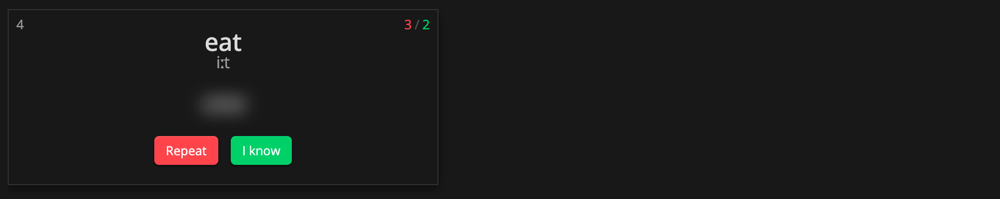
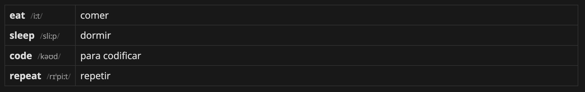

## Obsidian Vocabulary Cards Plugin
Vocabulary Cards is a plugin for obsidian displaying words and their meanings in an easy-to-learn format

### Usage

The block format must be compatible with YAML.

*Create a block with the simple format:*

```
    ```voca-table
    word: explanation
    word2: <transcription2> explanation2
    word3: <transcription3> explanation3

    ```
```

*Extended format:*

```
    ```voca-table
    
    - 
        word: Your word
        transcription: Your transcription
        explanation: Your explanation
    - 
        word: Another word
        transcription: Another transcription
        explanation: Another  explanation

    ```
```

**Same formats for Flashcards:**

```
    ```voca-card
    word: explanation
    word2: <transcription2> explanation2
    word3: <transcription3> explanation3

    ```
```

### Blocktypes
There are 2 types of block available:  
- **voca-card**:   Preview the words as a card. One randomly picked word at a time.
- **voca-table**:  Preview the words as a list. All words are shown.

### Statistics

There is file `data.json` in the plugin folder. 
The file contains statistics about correct answers. For reset statistics, delete the file.

### Example
For example:  

```
    ```voca-card
    
    eat: <iːt> comer  
    sleep: <sliːp> dormir
    code: <kəʊd> para codificar
    repeat: <rɪˈpiːt> repetir
    
    ```
```
will be displayed as:  



```
    ```voca-table
    
    eat: <iːt> comer  
    sleep: <sliːp> dormir
    code: <kəʊd> para codificar
    repeat: <rɪˈpiːt> repetir
    
    ```
```
will be displayed as:




### Manually installing the plugin
- Disable obsidian safe mode.
- Copy over `main.js`, `styles.css`, `manifest.json` to your vault `VaultFolder/.obsidian/plugins/obsidian-vocabulary-cards/`.
